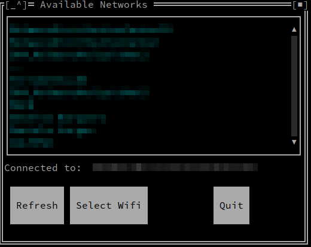
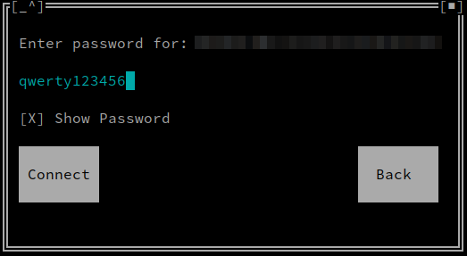

# nmclui
nmclui is a Go nmcli text user interface similar to nmtui.

This tool use the cli library coded by Vladimir Markelov <a href="https://github.com/VladimirMarkelov/clui"> here </a>

## Screenshots

